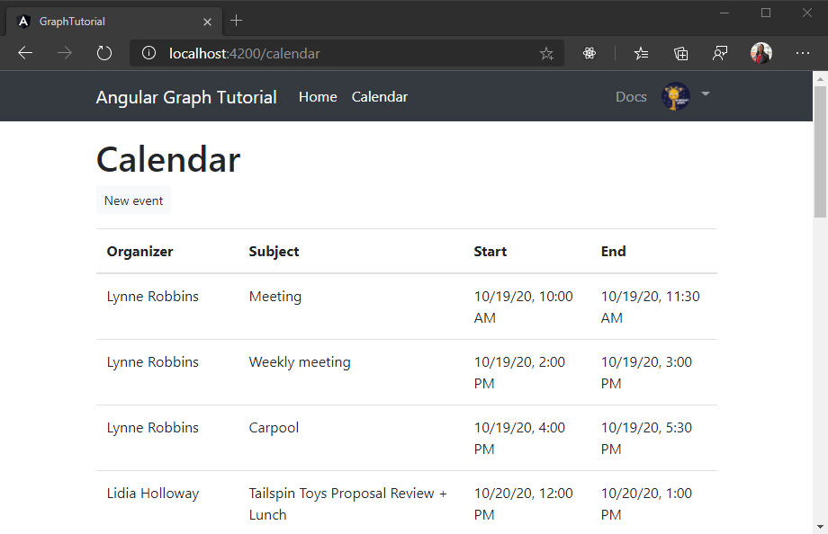

<!-- markdownlint-disable MD002 MD041 -->

<span data-ttu-id="923b1-101">В этом упражнении вы добавите Microsoft Graph в приложение.</span><span class="sxs-lookup"><span data-stu-id="923b1-101">In this exercise you will incorporate the Microsoft Graph into the application.</span></span> <span data-ttu-id="923b1-102">В этом приложении для совершения вызовов в Microsoft Graph будет использоваться [Клиентская библиотека Microsoft](https://github.com/microsoftgraph/msgraph-sdk-javascript) Graph.</span><span class="sxs-lookup"><span data-stu-id="923b1-102">For this application, you will use the [microsoft-graph-client](https://github.com/microsoftgraph/msgraph-sdk-javascript) library to make calls to Microsoft Graph.</span></span>

## <a name="get-calendar-events-from-outlook"></a><span data-ttu-id="923b1-103">Получение событий календаря из Outlook</span><span class="sxs-lookup"><span data-stu-id="923b1-103">Get calendar events from Outlook</span></span>

1. <span data-ttu-id="923b1-104">Создайте новый файл в `./src/app` каталоге `event.ts` и добавьте приведенный ниже код.</span><span class="sxs-lookup"><span data-stu-id="923b1-104">Create a new file in the `./src/app` directory called `event.ts` and add the following code.</span></span>

    :::code language="typescript" source="../demo/graph-tutorial/src/app/event.ts" id="eventClasses":::

1. <span data-ttu-id="923b1-105">Добавление новой службы для хранения всех вызовов графов.</span><span class="sxs-lookup"><span data-stu-id="923b1-105">Add a new service to hold all of your Graph calls.</span></span> <span data-ttu-id="923b1-106">Выполните следующую команду в командной панели CLI.</span><span class="sxs-lookup"><span data-stu-id="923b1-106">Run the following command in your CLI.</span></span>

    ```Shell
    ng generate service graph
    ```

    <span data-ttu-id="923b1-107">Как и при работе со службой проверки подлинности, созданной ранее, создание службы позволяет вставить ее в любой компонент, которому необходим доступ к Microsoft Graph.</span><span class="sxs-lookup"><span data-stu-id="923b1-107">Just as with the authentication service you created earlier, creating a service for this allows you to inject it into any components that need access to Microsoft Graph.</span></span>

1. <span data-ttu-id="923b1-108">После выполнения команды откройте `./src/app/graph.service.ts` файл и замените его содержимое на следующее:</span><span class="sxs-lookup"><span data-stu-id="923b1-108">Once the command completes, open the `./src/app/graph.service.ts` file and replace its contents with the following.</span></span>

    :::code language="typescript" source="../demo/graph-tutorial/src/app/graph.service.ts" id="graphServiceSnippet":::

    <span data-ttu-id="923b1-109">Рассмотрите, что делает этот код.</span><span class="sxs-lookup"><span data-stu-id="923b1-109">Consider what this code is doing.</span></span>

    - <span data-ttu-id="923b1-110">Он инициализирует клиент Graph в конструкторе для службы.</span><span class="sxs-lookup"><span data-stu-id="923b1-110">It initializes a Graph client in the constructor for the service.</span></span>
    - <span data-ttu-id="923b1-111">Он реализует `getEvents` функцию, использующую клиент Graph, следующим образом:</span><span class="sxs-lookup"><span data-stu-id="923b1-111">It implements a `getEvents` function that uses the Graph client in the following way:</span></span>
      - <span data-ttu-id="923b1-112">URL-адрес, который будет вызываться — это `/me/events`.</span><span class="sxs-lookup"><span data-stu-id="923b1-112">The URL that will be called is `/me/events`.</span></span>
      - <span data-ttu-id="923b1-113">`select` Метод ограничит поля, возвращаемые для каждого события, только теми, которые будут реально использоваться в представлении.</span><span class="sxs-lookup"><span data-stu-id="923b1-113">The `select` method limits the fields returned for each events to just those the view will actually use.</span></span>
      - <span data-ttu-id="923b1-114">`orderby` Метод сортирует результаты по дате и времени создания, начиная с самого последнего элемента.</span><span class="sxs-lookup"><span data-stu-id="923b1-114">The `orderby` method sorts the results by the date and time they were created, with the most recent item being first.</span></span>

1. <span data-ttu-id="923b1-115">Создайте угловой компонент, чтобы вызвать этот новый метод и отобразить результаты вызова.</span><span class="sxs-lookup"><span data-stu-id="923b1-115">Create an Angular component to call this new method and display the results of the call.</span></span> <span data-ttu-id="923b1-116">Выполните следующую команду в командной панели CLI.</span><span class="sxs-lookup"><span data-stu-id="923b1-116">Run the following command in your CLI.</span></span>

    ```Shell
    ng generate component calendar
    ```

1. <span data-ttu-id="923b1-117">После выполнения команды добавьте компонент в `routes` массив. `./src/app/app-routing.module.ts`</span><span class="sxs-lookup"><span data-stu-id="923b1-117">Once the command completes, add the component to the `routes` array in `./src/app/app-routing.module.ts`.</span></span>

    ```TypeScript
    import { CalendarComponent } from './calendar/calendar.component';

    const routes: Routes = [
      { path: '', component: HomeComponent },
      { path: 'calendar', component: CalendarComponent }
    ];
    ```

1. <span data-ttu-id="923b1-118">Откройте `./src/app/calendar/calendar.component.ts` файл и замените его содержимое на приведенный ниже код.</span><span class="sxs-lookup"><span data-stu-id="923b1-118">Open the `./src/app/calendar/calendar.component.ts` file and replace its contents with the following.</span></span>

    ```TypeScript
    import { Component, OnInit } from '@angular/core';
    import * as moment from 'moment-timezone';

    import { GraphService } from '../graph.service';
    import { Event, DateTimeTimeZone } from '../event';
    import { AlertsService } from '../alerts.service';

    @Component({
      selector: 'app-calendar',
      templateUrl: './calendar.component.html',
      styleUrls: ['./calendar.component.css']
    })
    export class CalendarComponent implements OnInit {

      public events: Event[];

      constructor(
        private graphService: GraphService,
        private alertsService: AlertsService) { }

      ngOnInit() {
        this.graphService.getEvents()
          .then((events) => {
            this.events = events;
            // Temporary to display raw results
            this.alertsService.add('Events from Graph', JSON.stringify(events, null, 2));
          });
      }
    }
    ```

<span data-ttu-id="923b1-119">Теперь это просто отрисовывает массив событий в JSON на странице.</span><span class="sxs-lookup"><span data-stu-id="923b1-119">For now this just renders the array of events in JSON on the page.</span></span> <span data-ttu-id="923b1-120">Сохраните изменения и перезапустите приложение.</span><span class="sxs-lookup"><span data-stu-id="923b1-120">Save your changes and restart the app.</span></span> <span data-ttu-id="923b1-121">Войдите и щелкните ссылку **Календарь** на панели навигации.</span><span class="sxs-lookup"><span data-stu-id="923b1-121">Sign in and click the **Calendar** link in the nav bar.</span></span> <span data-ttu-id="923b1-122">Если все работает, вы должны увидеть дамп событий JSON в календаре пользователя.</span><span class="sxs-lookup"><span data-stu-id="923b1-122">If everything works, you should see a JSON dump of events on the user's calendar.</span></span>

## <a name="display-the-results"></a><span data-ttu-id="923b1-123">Отображение результатов</span><span class="sxs-lookup"><span data-stu-id="923b1-123">Display the results</span></span>

<span data-ttu-id="923b1-124">Теперь вы можете обновить `CalendarComponent` компонент, чтобы отображать события более удобным для пользователя способом.</span><span class="sxs-lookup"><span data-stu-id="923b1-124">Now you can update the `CalendarComponent` component to display the events in a more user-friendly manner.</span></span>

1. <span data-ttu-id="923b1-125">Удалите временный код, который добавляет оповещение из `ngOnInit` функции.</span><span class="sxs-lookup"><span data-stu-id="923b1-125">Remove the temporary code that adds an alert from the `ngOnInit` function.</span></span> <span data-ttu-id="923b1-126">Обновленная функция должна выглядеть так, как показано ниже.</span><span class="sxs-lookup"><span data-stu-id="923b1-126">Your updated function should look like this.</span></span>

    :::code language="typescript" source="../demo/graph-tutorial/src/app/calendar/calendar.component.ts" id="ngOnInitSnippet":::

1. <span data-ttu-id="923b1-127">Добавьте функцию в `CalendarComponent` класс, чтобы отформатировать `DateTimeTimeZone` объект в строку ISO.</span><span class="sxs-lookup"><span data-stu-id="923b1-127">Add a function to the `CalendarComponent` class to format a `DateTimeTimeZone` object into an ISO string.</span></span>

    :::code language="typescript" source="../demo/graph-tutorial/src/app/calendar/calendar.component.ts" id="formatDateTimeTimeZoneSnippet":::

1. <span data-ttu-id="923b1-128">Откройте `./src/app/calendar/calendar.component.html` файл и замените его содержимое на приведенный ниже код.</span><span class="sxs-lookup"><span data-stu-id="923b1-128">Open the `./src/app/calendar/calendar.component.html` file and replace its contents with the following.</span></span>

    :::code language="html" source="../demo/graph-tutorial/src/app/calendar/calendar.component.html" id="calendarHtml":::

<span data-ttu-id="923b1-129">В результате получается цикл по коллекции событий и добавляется строка таблицы для каждой из них.</span><span class="sxs-lookup"><span data-stu-id="923b1-129">This loops through the collection of events and adds a table row for each one.</span></span> <span data-ttu-id="923b1-130">Сохраните изменения и перезапустите приложение.</span><span class="sxs-lookup"><span data-stu-id="923b1-130">Save the changes and restart the app.</span></span> <span data-ttu-id="923b1-131">Щелкните ссылку **Календарь** , после чего приложение должно отобразить таблицу событий.</span><span class="sxs-lookup"><span data-stu-id="923b1-131">Click on the **Calendar** link and the app should now render a table of events.</span></span>


